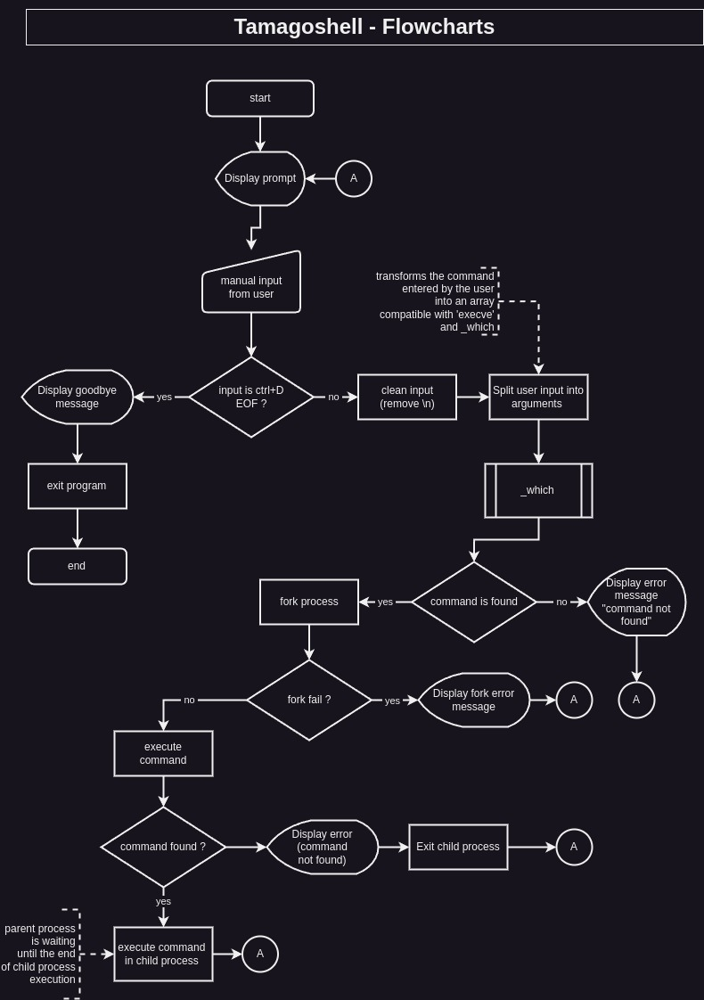

<p align="center">
  
</p>


## Description
Tamago-shell is a simple shell developed as an end-of-term project during the first trimester of the Web and Mobile Developer training program at Holberton school.


## Demo
Tamago-shell in action :


## Features
Tamago-shell is a simple shell with an added feature: it displays ASCII emoji heads when you type commands, inspired by the iconic Japanese electronic game Tamagotchi.

### Key Features:
- Executes commands interactively and non-interactively.
- Parses user input and tokenizes it into commands and arguments.
- Searches for executable programs.
- Handles basic errors, such as "command not found."
- Ensures no memory leaks.

## Requirements
Because it's a school project, we have some limitations :
- *OS* : should work on Ubuntu 20.04 LTS
- *Compiler:* gcc with flags -Wall -Werror -Wextra -pedantic -std=gnu89
- *Style:* The code should be OK with the linter Betty
- *Output:* Matches /bin/sh exactly except for the program name in error messages.
- *Memory:* No memory leaks are allowed.
- *File Structure:* No more than 5 functions per file, and all headers must have include guards.
- *Allowed Functions and System Calls*:
    - *Standard Library Functions*:
        - All functions from `string.h`
    - **System Calls**:
        - `access`
        - `chdir`
        - `close`
        - `closedir`
        - `execve`
        - `exit`
        - `_exit`
        - `fflush`
        - `fork`
        - `free`
        - `getcwd`
        - `getline`
        - `getpid`
        - `isatty`
        - `kill`
        - `malloc`
        - `open`
        - `opendir`
        - `perror`
        - `printf`
        - `fprintf`
        - `vfprintf`
        - `sprintf`
        - `putchar`
        - `read`
        - `readdir`
        - `signal`
        - `stat`
        - `lstat`
        - `fstat`
        - `strtok`
        - `wait`
        - `waitpid`
        - `wait3`
        - `wait4`
        - `write`


## Getting Started

### Prerequisite
Having a computer running Linux, or a virtual mahcine with Linux, or WSL for Linux, and theses packages :
- git version 2.34.1
- gcc 11.4.0

### Installation Process
 1. Clone / download the repository
```bash
git clone https://github.com/OursBlanc42/holbertonschool-simple_shell
```
 2. Compile the project
```bash
gcc -Wall -Werror -Wextra -pedantic -std=gnu89 *.c -o tamagoshell
```
3. Run the shell
```bash
./tamagoshell
```
4. Type command to see the tamagochi heads in action!

You can also download the executable directly from here : 


## Flowcharts


For more detail about the recoding of our own `_which` function please click below :
[_which flowchart](https://github.com/OursBlanc42/holbertonschool-simple_shell/blob/main/docs/flowcharts/_which.jpg)


## Version
Current version: 1.0


## Roadmap
Next version of Tamagoshell will include somes enhancements like :
- **Built-in Commands**: `exit` to terminate the shell session and `env` to display the environment variables.


## Authors
- **OursBlanc42** (a.k.a. Simon) - [GitHub Profile](https://github.com/oursblanc42)
- **Tefa95100** (a.k.a. Damien) - [GitHub Profile](https://github.com/tefa95100)


## Made with :
- **Operating System:** Tested on:
    - Linux Mint 21.3
    - Ubuntu 24.04.1 LTS on Windows 10 x86_64 

- **Tools:** 
    - git version 2.34.1
    - GCC 11.4.0  (compilation flag : `-Wall -Werror -Wextra -pedantic -std=gnu89`)
    - Valgrind 3.18.1
    - Draw.io for flowcharts


## License
This project is licensed under the [Attribution-NonCommercial 4.0 International - CC BY-NC 4.0 - Deed](https://creativecommons.org/licenses/by-nc/4.0/).


## Acknowledgements
- The Holberton HDF campus team and all Holbies.
- The wonderful free software and open source community.
- Akihiro Yokoi & Aki Maita inventor of the Tamagotchi.


