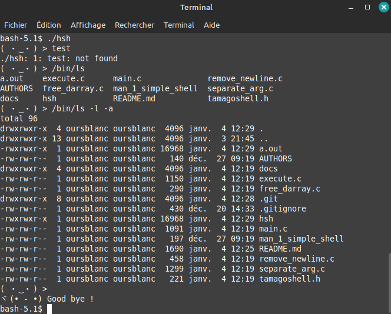

# Tamago-shell

## Description

Tamago-shell is a simple shell developed as an end-of-term project during the first trimester of the Web and Mobile Developer training program at Holberton school.

---

## Demo
Tamago-shell in action :



---

## Features

Tamago-shell is a simple shell with an added feature: it displays ASCII emoji heads when you type commands, inspired by the iconic Japanese electronic game tamagotchi.

---

## Getting Started

### System & Tools
- **Operating System:** Tested on:
    - Linux Mint 21.3
    - Windows through WSL

- **Tools:** 
    - GCC 11.4.0  (compilation flag : `-Wall -Werror -Wextra -pedantic -std=gnu89`)
    - Valgrind 3.18.1
    - Draw.io for flowcharts

### Installing
 1. Clone / download the repository
 2. Compile the project
```bash
gcc -Wall -Werror -Wextra -pedantic -std=gnu89 *.c -o hsh
```
3. Run the shell
4. Type stuff to see the tamagochi heads in action!


---

## Flowcharts


---

## Version
Current version: 0.2.5


---

## Roadmap
🚧 UNDER CONSTRUCTION 🚧

---

## Authors

- **OursBlanc42** (a.k.a. Simon) - [GitHub Profile](https://github.com/oursblanc42)
- **Tefa95100** (a.k.a. Damien) - [GitHub Profile](https://github.com/tefa95100)

---

## License
This project is licensed under the [Attribution-NonCommercial 4.0 International - CC BY-NC 4.0 - Deed](https://creativecommons.org/licenses/by-nc/4.0/).

---

## Acknowledgements
- The Holberton HDF campus team and all Holbies.
- The wonderful free software and open source community.
- Akihiro Yokoi & Aki Maita inventor of the Tamagotchi.


